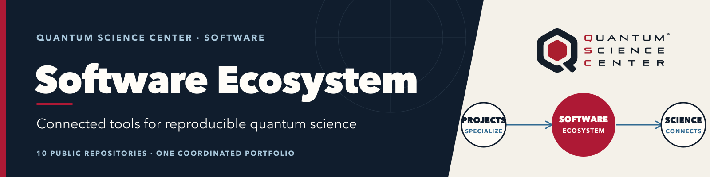
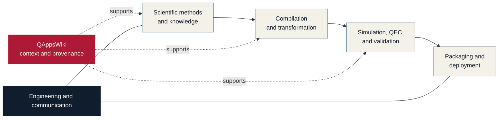

  

# Quantum Science Center Software Ecosystem

**The QSC Software Ecosystem connects independently developed quantum-science
methods, compilers, simulators, knowledge, and delivery tools into a more
interoperable, reproducible, and sustainable research environment.**

[Explore the website](https://qscsoftwareecosystem.github.io/) ·
[Browse all repositories](https://github.com/orgs/QSCSoftwareEcosystem/repositories) ·
[Use the README guide](../brand/README.md) ·
[Start from the template](../templates/README.template.md)

> The projects below remain owned by their contributing teams and vary in
> maturity and release status. Each repository is the source of truth for its
> supported capabilities.

## At a glance

| | |
| --- | --- |
| **Public portfolio** | 10 repositories |
| **Research path** | Methods and knowledge → compilation → simulation and validation → delivery |
| **Shared priorities** | Interoperability, reproducibility, provenance, and sustainability |
| **Last reviewed** | 2026-08-25 |

## Public repository portfolio

### Scientific methods and knowledge

| Repository | Role in the ecosystem |
| --- | --- |
| [OpenQEvo](https://github.com/QSCSoftwareEcosystem/OpenQEvo) | Reusable Python interfaces, context, and framework adapters for quantum-evolution methods. |
| [QAppsWiki](https://github.com/QSCSoftwareEcosystem/QAppsWiki) | Provenance-backed quantum-computing knowledge base and graph for researchers, software, and agents. |

### Compilation, simulation, and fault tolerance

| Repository | Role in the ecosystem |
| --- | --- |
| [qasmtrans](https://github.com/QSCSoftwareEcosystem/qasmtrans) | C++ transpiler that maps OpenQASM circuits to target gate sets and device topologies. |
| [STABSim](https://github.com/QSCSoftwareEcosystem/STABSim) | GPU- and MPI-enabled stabilizer simulation for quantum error correction and noisy circuits. |
| [FTCircuitBench](https://github.com/QSCSoftwareEcosystem/FTCircuitBench) | Benchmark suite for fault-tolerant circuit compilation, Clifford+T synthesis, and Pauli-based computation. |
| [FTPrimitiveBench](https://github.com/QSCSoftwareEcosystem/FTPrimitiveBench) | Constructs and benchmarks fault-tolerant primitives under hardware-motivated noise models. |

### Delivery and ecosystem infrastructure

| Repository | Role in the ecosystem |
| --- | --- |
| [spack-packages](https://github.com/QSCSoftwareEcosystem/spack-packages) | Spack package recipes for developing and deploying QSC software. |
| [QSCSoftwareEcosystem.github.io](https://github.com/QSCSoftwareEcosystem/QSCSoftwareEcosystem.github.io) | Source for the public QSC Software Ecosystem website. |
| [.github](https://github.com/QSCSoftwareEcosystem/.github) | Organization profile, shared repository-branding guide, and reusable README template. |

### Scientific communication

| Repository | Role in the ecosystem |
| --- | --- |
| [HighlightSlides](https://github.com/QSCSoftwareEcosystem/HighlightSlides) | Automates the creation of QSC and DOE highlight slides from scientific papers and PDFs. |

## How the portfolio fits together

*The ecosystem connects specialized projects across a research path while each
team retains responsibility for its scientific and software contributions.*

## Shared working principles

- **Connect:** define usable boundaries between independently developed tools.
- **Preserve:** carry context, provenance, and evidence through the research path.
- **Sustain:** improve testing, packaging, documentation, and reproducibility.
- **Respect ownership:** coordinate projects without dissolving team accountability.

## Start here

- Visit the [QSC Software Ecosystem website](https://qscsoftwareecosystem.github.io/)
  for the portfolio narrative and capability map.
- Open the [repository branding guide](../brand/README.md) when preparing or
  refreshing a project README.
- Use the [minimal README template](../templates/README.template.md) as an
  adaptable starting point.
- Review the separate [release-readiness checklist](../brand/RELEASE_READINESS.md)
  when preparing a versioned or supported release.
- Use the relevant repository's issue tracker for project-specific questions,
  contributions, or support requests.
