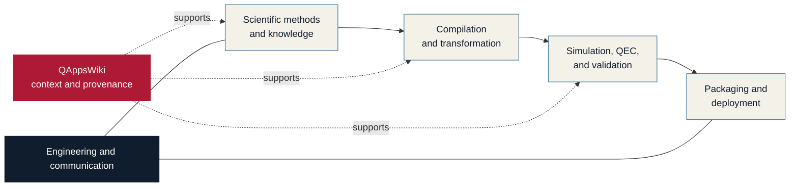

  

# Quantum Science Center Quantum-HPC Ecosystem

**The Quantum Science Center (QSC) brings together world-leading expertise and unique capabilities from the national laboratories, academic institutions, and industry to realize its ambitious vision of a fault-tolerant quantum high-performance computing (QHPC) ecosystem, which will provide opportunity for unprecedented impacts on quantum computing. Through the convergence of quantum computing with leadership-class HPC systems, the QSC is developing a holistic software ecosystem that combines research in hybrid algorithms, scientific applications, QHPC architectures, and experimental validation that amplifies the impact of fault-tolerant quantum computing. For more information about QSC, visit [www.qscience.org](www.qscience.org)**

**The QSC QHPC Ecosystem is a software implementation that integrates the development of quantum algorithms and applications with quantum compilers, simulators, knowledge bases, and delivery tools into an interoperable, reproducible, and sustainable research environment. Find more information about the available code and data reposititories, development guides, and other resources at the links below.**

[QSC QHPC Ecosystem Overview](https://qscsoftwareecosystem.github.io/) ·
[Browse all repositories](https://github.com/orgs/QSCSoftwareEcosystem/repositories) ·
[Use the README guide](../brand/README.md) 
<!-- [Start from the template](../templates/README.template.md) -->

> The QSC QHPC Ecosystem coordinates the research and development of new tools and techniques for hybrid quantum computing. As research tools, the available repositories represent varying levels of maturity and release status. Each individual project below is maintained by their corresponding contributing teams.

## Ecosystem at a Glance

| | |
| --- | --- |
| **Public portfolio** | 10 repositories |
| **Research path** | Methods and knowledge → compilation → simulation and validation → delivery |
| **Shared priorities** | Interoperability, reproducibility, provenance, and sustainability |
| **Last reviewed** | 2026-09-22 |

## Capability Portfolio

### Workflow management and dashboard
| Repository | Role in the Ecosystem |
| --- | --- |
| [QHPC-Ecosystem](https://github.com/QSCSoftwareEcosystem/QHPC-Ecosystem) | Local workbench that hosts QSC QHPC tools in one place|

### Scientific methods and knowledge

| Repository | Role in the ecosystem |
| --- | --- |
| [OpenQEvo](https://github.com/QSCSoftwareEcosystem/OpenQEvo) | Reusable Python interfaces, context, and framework adapters for quantum-evolution methods. |
| [QAppsWiki](https://github.com/QSCSoftwareEcosystem/QAppsWiki) | Provenance-backed quantum-computing knowledge base and graph for researchers, software, and agents. |

### Compilation, simulation, and fault tolerance

| Repository | Role in the ecosystem |
| --- | --- |
| [qasmtrans](https://github.com/QSCSoftwareEcosystem/qasmtrans) | C++ transpiler that maps OpenQASM circuits to target gate sets and device topologies. |
| [STABSim](https://github.com/QSCSoftwareEcosystem/STABSim) | GPU- and MPI-enabled stabilizer simulation for quantum error correction and noisy circuits. |
| [FTCircuitBench](https://github.com/QSCSoftwareEcosystem/FTCircuitBench) | Benchmark suite for fault-tolerant circuit compilation, Clifford+T synthesis, and Pauli-based computation. |
| [FTPrimitiveBench](https://github.com/QSCSoftwareEcosystem/FTPrimitiveBench) | Constructs and benchmarks fault-tolerant primitives under hardware-motivated noise models. |

### Delivery and ecosystem infrastructure

| Repository | Role in the ecosystem |
| --- | --- |
| [spack-packages](https://github.com/QSCSoftwareEcosystem/spack-packages) | Spack package recipes for developing and deploying QSC software. |
| [QSCSoftwareEcosystem.github.io](https://github.com/QSCSoftwareEcosystem/QSCSoftwareEcosystem.github.io) | Source for the public QSC Software Ecosystem website. |
| [.github](https://github.com/QSCSoftwareEcosystem/.github) | Organization profile, shared repository-branding guide, and reusable README template. |

### Scientific communication

| Repository | Role in the ecosystem |
| --- | --- |
| [HighlightSlides](https://github.com/QSCSoftwareEcosystem/HighlightSlides) | Automates the creation of QSC and DOE highlight slides from scientific papers and PDFs. |

## How the portfolio fits together

*The QSC QHPC Ecosystem connects the different, specialized tools and techniques into an interoperable research workflow. The QHPC-Ecossytem workbench provides a all-in-one platform to access these tools.*

## How to get started

- **Visit the [QSC Software Ecosystem website](https://qscsoftwareecosystem.github.io/)  for a deeper understanding of the capability portfolio and capability map.***
- **Install [QHPC-Ecosystem](https://github.com/QSCSoftwareEcosystem/QHPC-Ecosystem), a local workbench that hosts the integrate QSC QHPC tools all in one place.***
- **Provide feedback through the issues tracker to help improve the ecosystem and request new features or support.***
